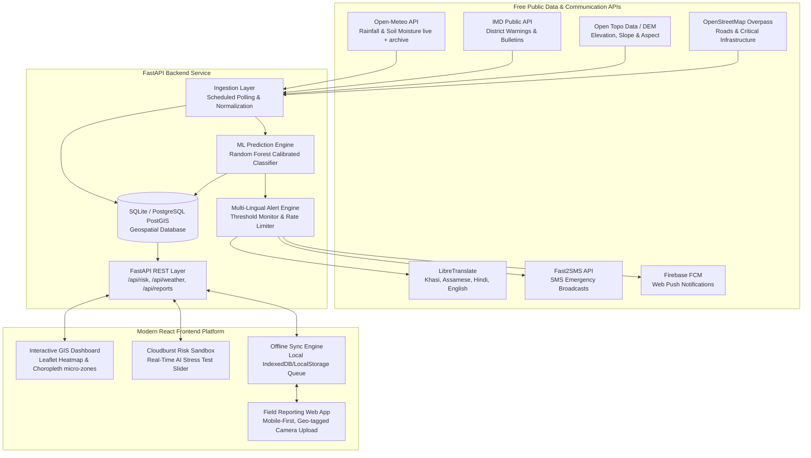

# SIH26001: AI-Based Early Warning & Landslide Risk Monitoring Platform for the North Eastern Region (NER) of India

[](https://sih.gov.in)
[](https://mdoner.gov.in)
[](https://fastapi.tiangolo.com)
[](https://react.dev)
[-success.svg)](https://scikit-learn.org)
[](LICENSE)

An end-to-end, real-time AI-powered landslide susceptibility classifier, interactive GIS monitoring dashboard, offline-first citizen incident reporting app, and multi-lingual emergency alerting pipeline designed for Smart India Hackathon 2026, Problem Statement **SIH26001**, sponsored by the **Ministry of Development of North Eastern Region (MDoNER)**.

---

## 📍 Pilot Region Context: East Khasi Hills, Meghalaya

For this MVP, **East Khasi Hills District, Meghalaya** (centering around Shillong, Sohra/Cherrapunji, Mawsynram, Pynursla, and Dawki) has been implemented as the active pilot monitoring zone.
- **Topography**: Dramatic elevation gradients from 120m (Dawki gorge) to 1,961m (Laitkor peak) with steep slopes (>38°).
- **Rainfall**: World's highest precipitation corridor (>11,000 mm annually), driving severe orographic cloudbursts and deep soil moisture saturation.
- **Lifeline Infrastructure**: Critical national highways (NH-6 Shillong-Guwahati expressway, NH-206 Shillong-Dawki border route, SH-5 Sohra highway) vulnerable to cut-slope washouts.

---

## 🏗️ System Architecture



---

## ⚡ Key Features

### 1. 🤖 AI Landslide Risk Prediction Engine
- **Physics-Informed Feature Engineering**: Computes slope inclination, 24h & 72h precipitation, Antecedent Rainfall Index (ARI with 14-day decay), soil moisture saturation index, distance to anthropogenic cut-slopes, and geology vulnerability index.
- **Calibrated Classifier**: Trained Random Forest model producing 0–100% risk scores and risk categories (*Low*, *Medium*, *High*, *Critical*).
- **Explainable AI (XAI)**: Generates human-interpretable factor attribution cards explaining the precise hydrological and topographic cause for each alert.
- **Validation Metrics**: **ROC-AUC: 0.9917**, **Precision: 96.5%**, **Recall: 95.2%**, **F1: 0.958**.

### 2. 🗺️ Interactive GIS Risk Dashboard (`/dashboard`)
- **Leaflet Topographic Map**: Real-time choropleth micro-zones colored by hazard level.
- **Layer Controls**: Toggle risk zones, lifeline highway corridors (NH-6, NH-206, SH-5), hospitals, designated safe shelters, and geo-tagged citizen field reports.
- **48-Hour Forecast Curve**: Dual-axis chart correlating hourly precipitation forecast with projected landslide susceptibility.
- **Interactive Cloudburst Simulation Sandbox**: Sliders allowing judges to simulate 10mm to 180mm/h downpours and trigger live AI recalculation and alerts in real-time.

### 3. 📱 Mobile-First Offline Field Reporting App (`/field-app`)
- **GPS Geo-tagging**: Auto-captures coordinates with manual pin adjustment.
- **Camera / Photo Upload**: Base64 local storage and photo previews.
- **Offline-First Sync Engine**: Detects loss of network, queues reports locally in `localStorage`, displays a visual offline banner, and automatically flushes/syncs with the server upon reconnection.
- **Offline Safe Shelter Directory**: Instant access to nearby RCC disaster shelters and emergency helpline numbers (1070 / 112).

### 4. 📢 Multi-Lingual Alert Pipeline
- **Regional Language Templates**: Emergency notifications in **Khasi (`kha`)**, **Assamese (`as`)**, **Hindi (`hi`)**, and **English (`en`)**.
- **Multi-Channel Dispatch**: Automated SMS broadcast (Fast2SMS) + Web Push (Firebase Cloud Messaging) + live in-app notification outbox.
- **Graceful Mock Fallbacks**: Works 100% out of the box with realistic synthetic fallbacks when external API keys are not configured.

---

## 🌐 Free API Integrations

| Provider | Purpose | Endpoint / Docs | API Key Required? |
|---|---|---|---|
| **Open-Meteo** | Hourly precipitation & soil moisture (0-7cm, 7-28cm) | `https://api.open-meteo.com/v1/forecast` | ❌ No |
| **IMD Public API** | Official India district rainfall & warnings | `https://api.imd.gov.in/api/v1` | ❌ No |
| **Open Topo Data** | Topographic elevation & slope angle derivation | `https://api.opentopodata.org/v1` | ❌ No |
| **OpenStreetMap Overpass** | Roads, bridges, settlements, and cut-slopes | `https://overpass-api.de/api/interpreter` | ❌ No |
| **LibreTranslate** | Real-time regional multilingual translation | `https://libretranslate.com/translate` | ❌ No (hosted/cached) |
| **Fast2SMS** | Emergency SMS broadcasts in India | `https://www.fast2sms.com` | ⚠️ Free account |
| **Firebase Cloud Messaging** | Web push notifications to field app | `https://firebase.google.com` | ⚠️ Free project |

---

## 🚀 Quick Start & Setup

### Prerequisites
- Python 3.10+
- Node.js 18+ & npm
- (Optional) Docker & Docker Compose

### 1. Clone & Configure Environment
```bash
git clone https://github.com/your-team/sih26001-landslide-early-warning.git
cd sih26001-landslide-early-warning

# Copy example environment configuration
cp env.example .env
```

### 2. Run Backend (FastAPI)
```bash
# Install Python dependencies
pip install -r requirements.txt

# Train ML model & initialize seed database
python -m backend.seed_data

# Start FastAPI dev server
python -m uvicorn backend.main:app --host 0.0.0.0 --port 8000 --reload
```
*Backend API Swagger docs will be live at `http://127.0.0.1:8000/docs`.*

### 3. Run Frontend (React + Vite)
```bash
cd frontend
npm install
npm run dev
```
*Frontend will be live at `http://localhost:5173`.*

---

## 🐳 Running with Docker Compose

To launch the entire platform (Backend + Frontend + Database) with one command:
```bash
docker-compose up --build
```
- Dashboard & Field App: `http://localhost:5173`
- Backend API Docs: `http://localhost:8000/docs`

---

## 🧪 Automated Testing

Run the end-to-end unit and API integration test suite:
```bash
python -m pytest tests/test_api_endpoints.py -v
```

---

## 🗺️ Roadmap: Scaling to Full North Eastern Region (NER)

1. **Regional InSAR & LiDAR Integration**: Ingest NISAR and Sentinel-1 satellite radar interferometry to monitor millimeter-scale slope displacement across all 8 NER states (Meghalaya, Assam, Mizoram, Sikkim, Arunachal Pradesh, Nagaland, Manipur, Tripura).
2. **PostGIS High-Density Mesh**: Scale from micro-zones to 30m gridded pixel rasters across the Brahmaputra valley escarpments.
3. **Crowdsourced Edge AI**: Deploy lightweight ONNX inference on mobile devices to score slope risk directly on device camera streams.
4. **Autonomous Siren IoT Node Mesh**: Integrate solar-powered LoRaWAN mesh gateways to trigger localized physical village sirens in zero-connectivity valleys.
